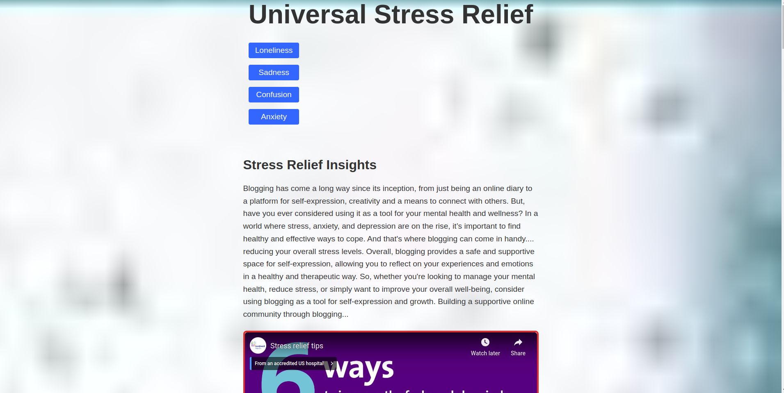
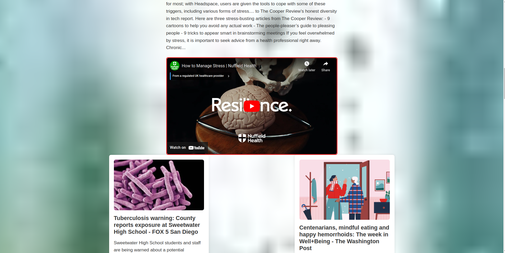

# Mental Health and wellness Website

## Overview

- This project is a web page that provides news and insights on mental health and stress relief. The page is built using HTML, CSS, and JavaScript. The following instructions will guide you on how to retrieve the code from GitHub, set it up on VSCode, and run it. Additionally, we will explain the HTML and JavaScript code in detail.


## Tools Used

- HTML5
- CSS3
- JavaScript


you can download [vscode](https://code.visualstudio.com/download) to practice the code.

## Setup

To get started with this project, ensure you have the following:

1. Linux, Windows, or MacOS
2. 4GB RAM
3. 10MB Storage
4. NodeJS v10.18
5. Npm install


### Steps

1. Clone this repository
    ```
    git clone https://github.com/LameckKambi/Phase1-Project-LameckKambi.git
    ```

2. Open the cloned repo on Visual Studio Code.
3. Using LiveServer, open the `index.html` file.
4. Ensure you've installed JSON server in your machine

- Now you're good to go.

## Demo

The app, when run, looks as follows:







## Authors

This repo is currently being maintained by:

- Lameck Kambi


## Code Review

### HTML Code
The HTML code for this project is structured as follows:
- The header section contains the page title, navigation menu, and logo.
- The main section contains the blog content, videos, and news cards.
- The footer section contains the container menu with links to mental health resources and stress relief activities.
The navigation menu and container menu are implemented using unordered lists (ul) and list items (li). The links in the navigation menu are implemented using anchor tags (a) with href attributes that point to the corresponding stress relief insights. Similarly, the links in the container menu are implemented using anchor tags with href attributes that point to the relevant mental health resources and stress relief activities.


### JavaScript Code
The JavaScript code for this project is structured as follows:
- The DOMContentLoaded event listener was used to fetch news data from the News API and create news cards dynamically.
- The createNewsCard function was used to create a news card with a title, description, image, and link.
- The forEach method was used to iterate over the articles and create news cards for each article.
- The catch method was used to handle errors that may occur during the fetch request.

To add more functionality to the project, event listeners were added to the navigation links in the header section. When a link is clicked, it takes the user to the corresponding stress relief insights. Similarly, event listeners are added to the container menu links in the footer section. When a link is clicked, it takes the user to the relevant mental health resources and stress relief activities.


## License

This project is ported under the MIT License.

```
Copyright 2024 Lameck Kambi
Permission is hereby granted, free of charge, to any person obtaining a copy of this software and associated documentation files (the “Software”), to deal in the Software without restriction, including without limitation the rights to use, copy, modify, merge, publish, distribute, sublicense, and/or sell copies of the Software, and to permit persons to whom the Software is furnished to do so, subject to the following conditions:
The above copyright notice and this permission notice shall be included in all copies or substantial portions of the Software.
THE SOFTWARE IS PROVIDED “AS IS”, WITHOUT WARRANTY OF ANY KIND, EXPRESS OR IMPLIED, INCLUDING BUT NOT LIMITED TO THE WARRANTIES OF MERCHANTABILITY, FITNESS FOR A PARTICULAR PURPOSE AND NONINFRINGEMENT. IN NO EVENT SHALL THE AUTHORS OR COPYRIGHT HOLDERS BE LIABLE FOR ANY CLAIM, DAMAGES OR OTHER LIABILITY, WHETHER IN AN ACTION OF CONTRACT, TORT OR OTHERWISE, ARISING FROM, OUT OF OR IN CONNECTION WITH THE SOFTWARE OR THE USE OR OTHER DEALINGS IN THE SOFTWARE.
```